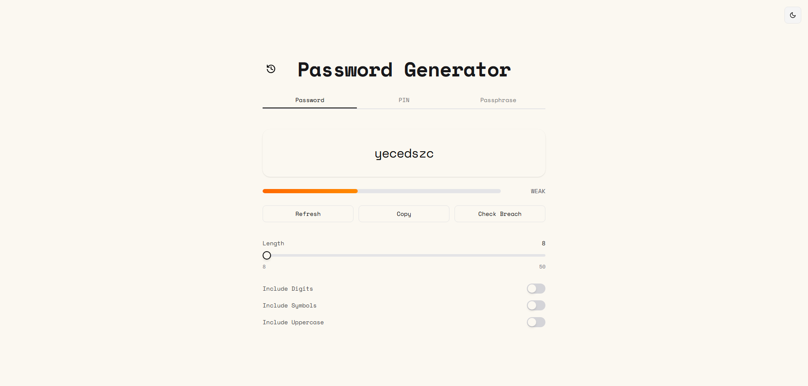
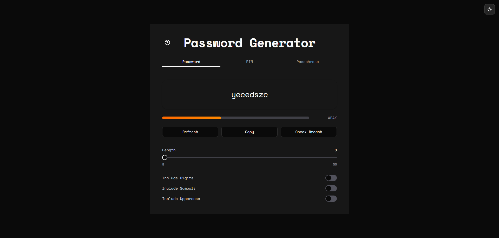
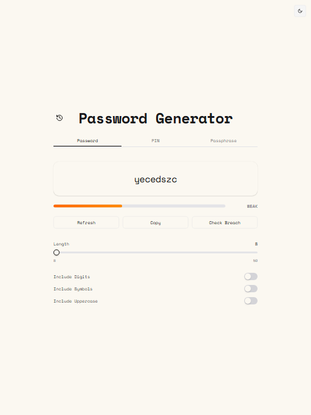
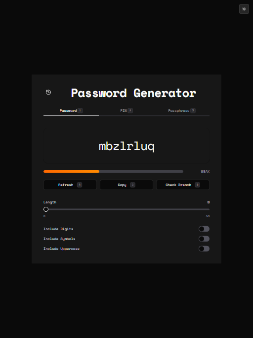
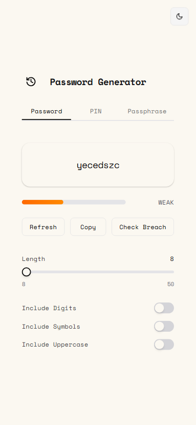
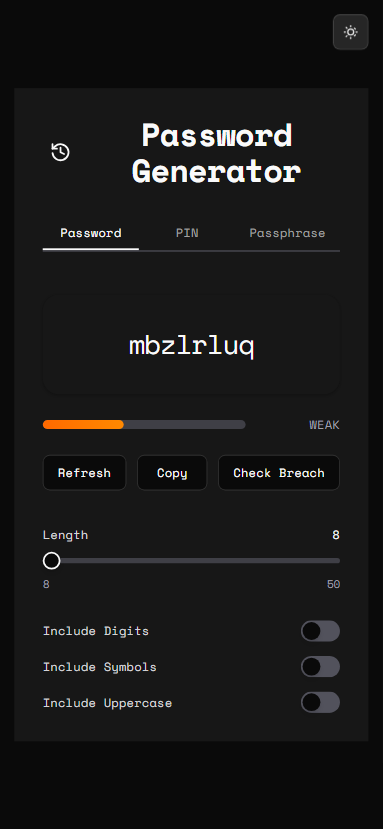

# Password Generator
[](https://nextjs.org/)
[](https://reactjs.org/)
[](https://www.typescriptlang.org/)
[](https://tailwindcss.com/)
[](https://nextjs-password-generator-clement.vercel.app/)

A secure, modern password generator built with Next.js 16, featuring password, PIN, and passphrase generation with cryptographically secure random number generation and breach checking via Have I Been Pwned API.

## Table of Contents

- [Demo & Screenshots](#demo--screenshots)
- [Key Features](#key-features)
- [Tech Stack](#tech-stack)
- [Security Implementation](#security-implementation)
- [Testing](#testing)
- [Quick Start](#quick-start)
- [Available Scripts](#available-scripts)
- [Project Structure](#project-structure)
- [License](#license)

## Demo & Screenshots
**Live Demo:** [Website](https://nextjs-password-generator-clement.vercel.app/)

**Video Demo**

https://github.com/user-attachments/assets/a65e6ba8-7700-4e33-b66f-6a55145bf327

### Screenshots

#### Desktop

| Light Mode | Dark Mode |
|------------|-----------|
|  |  |

#### Tablet

| Light Mode | Dark Mode |
|------------|-----------|
|  |  |

#### Mobile

| Light Mode | Dark Mode |
|------------|-----------|
|  |  |

## Key Features

- **Multiple Credential Types**
  - Password: 8-50 characters with customizable character sets
  - PIN: 3-12 digit numeric codes
  - Passphrase: 4-10 words from EFF Long Wordlist (7776 words)
- **Security Features**
  - Cryptographically secure random generation using Web Crypto API
  - Strength indicator for all credential types
  - Breach check integration with Have I Been Pwned API
- **User Experience**
  - Light/dark mode toggle with persisted preference
  - Responsive design (desktop, tablet, mobile)
  - Toast notifications centered at top for better visibility
  - One-click copy to clipboard
  - Credential history with slider navigation (last 10 generated)
  - Consistent muted background theme across all components

## Tech Stack

| Category | Technology |
|----------|------------|
| Framework | [Next.js 16](https://nextjs.org/) (App Router) |
| UI | [React 19](https://reactjs.org/), [Tailwind CSS 4](https://tailwindcss.com/) |
| Components | [Shadcn UI](https://ui.shadcn.com/) (Radix UI primitives) |
| Language | [TypeScript 5](https://www.typescriptlang.org/) (strict mode) |
| Security | [Web Crypto API](https://developer.mozilla.org/en-US/docs/Web/API/Web_Crypto_API) |
| Testing | [Vitest 4](https://vitest.dev/), [Playwright](https://playwright.dev/) |

## Security Implementation

### Cryptographically Secure Generation

All passwords, PINs, and passphrases are generated using the Web Crypto API (`crypto.getRandomValues`), ensuring cryptographically secure random number generation that cannot be predicted or reproduced. This is significantly more secure than `Math.random()` which is not suitable for security-sensitive applications.

### Breach Checking

The breach check feature uses the [Have I Been Pwned API](https://haveibeenpwned.com/API/v3) to check if a credential has appeared in known data breaches. The API uses **k-anonymity**, meaning only the first 5 characters of the SHA-1 hash are sent to the server - your actual password never leaves your device.

### Privacy

- No generated passwords are stored on any server
- All generation happens client-side in your browser
- Theme preference is stored locally in localStorage
- Credential history is stored locally and limited to the last 10 items

## Testing

This project uses a comprehensive testing strategy with both unit tests and E2E tests.

### Unit Tests (Vitest)

Unit tests are located in `tests/unit/` and cover:
- **Components**: UI component rendering and interactions
- **Hooks**: Custom React hook logic
- **Lib**: Utility functions (crypto, strength calculation, breach check)
- **API**: API route handlers

```bash
npm test                      # Run all unit tests
npm run test:watch            # Run tests in watch mode
npm run test:ui               # Run tests with Vitest UI
npm run test:coverage         # Run tests with coverage report

# Run a specific test file
npx vitest run tests/unit/hooks/use-password-generator.test.ts

# Run tests matching a pattern
npx vitest run -t "initializes and generates"
```

### E2E Tests (Playwright)

E2E tests are located in `tests/e2e/` and cover:
- Password, PIN, and passphrase generation flows
- UI interactions and accessibility
- Cross-browser compatibility

```bash
npm run test:e2e              # Run all E2E tests
npm run test:e2e:ui           # Run E2E tests with Playwright UI
npm run test:e2e:debug        # Run E2E tests in debug mode
npm run test:e2e:headed       # Run E2E tests in headed (visible browser) mode

# Run a specific test file
npx playwright test tests/e2e/password-generation.spec.ts

# Run a specific test by title
npx playwright test -g "should generate password on page load"
```

## Quick Start

```bash
# Clone the repository
git clone https://github.com/yourusername/nextjs-password-generator.git
cd nextjs-password-generator

# Install dependencies
npm install

# Run development server
npm run dev
# Open http://localhost:3000

# Build for production
npm run build

# Start production server
npm run start
```

## Available Scripts

| Command | Description |
|---------|-------------|
| `npm run dev` | Start development server (localhost:3000) |
| `npm run build` | Build for production |
| `npm run start` | Start production server |
| `npm run lint` | Run ESLint |
| `npm test` | Run all unit tests |
| `npm run test:watch` | Run tests in watch mode |
| `npm run test:ui` | Run tests with Vitest UI |
| `npm run test:coverage` | Run tests with coverage report |
| `npm run test:e2e` | Run all E2E tests |
| `npm run test:e2e:ui` | Run E2E tests with Playwright UI |
| `npm run test:e2e:debug` | Run E2E tests in debug mode |
| `npm run test:e2e:headed` | Run E2E tests in headed (visible browser) mode |

## Project Structure

```
├── app/                          # Next.js App Router
│   ├── api/                      # API routes
│   │   └── breach-check/         # Breach check API endpoint
│   ├── components/               # React components
│   │   ├── password-generator/   # Domain components
│   │   │   ├── password-display.tsx
│   │   │   ├── password-controls.tsx
│   │   │   ├── pin-controls.tsx
│   │   │   ├── passphrase-controls.tsx
│   │   │   ├── password-history.tsx
│   │   │   ├── history-slider.tsx
│   │   │   └── theme-toggle.tsx
│   │   └── ui/                   # Shadcn UI components
│   ├── hooks/                    # Custom React hooks
│   │   ├── use-password-generator.ts
│   │   ├── use-pin-generator.ts
│   │   ├── use-passphrase-generator.ts
│   │   ├── use-credential-history.ts
│   │   ├── use-breach-check.ts
│   │   ├── use-breach-check-handler.ts
│   │   ├── use-theme.ts
│   │   └── use-desktop.ts
│   ├── lib/                      # Utility functions and core logic
│   │   ├── crypto.ts             # Secure random generation
│   │   ├── strength.ts           # Strength calculation
│   │   ├── breach-check.ts       # Have I Been Pwned API client
│   │   ├── theme.ts              # Theme utilities
│   │   ├── eff-wordlist.ts       # EFF wordlist loader
│   │   └── eff-wordlist-content.ts
│   ├── types/                    # TypeScript definitions
│   ├── constants.ts              # App constants (history storage)
│   ├── globals.css               # Global styles
│   ├── layout.tsx                # Root layout
│   └── page.tsx                  # Home page
├── lib/                          # Shared utilities (cn function)
├── tests/
│   ├── setup.ts                  # Test setup and mocks
│   ├── test-helpers.ts           # Test utilities
│   ├── unit/                     # Vitest unit tests
│   │   ├── hooks/                # Hook tests
│   │   ├── lib/                  # Lib unit tests
│   │   └── api/                  # API route tests
│   └── e2e/                      # Playwright E2E tests
├── specs/                        # Feature specifications
├── screenshots/                  # Application screenshots
└── components/                   # Shared UI components (Shadcn)
```

## License

MIT License - see [LICENSE](LICENSE) for details.
